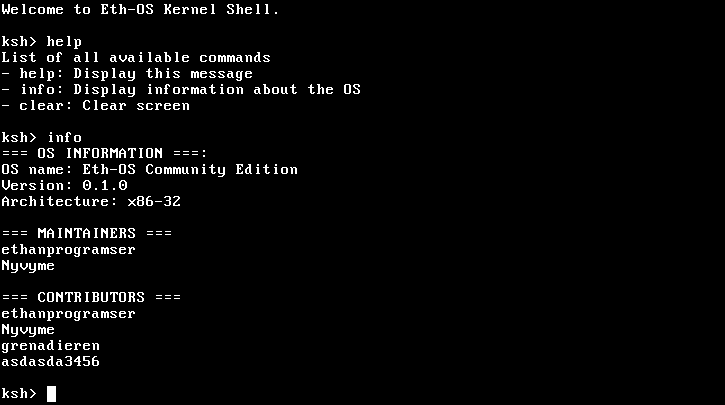

# Eth-OS Community Edition

Community driven 32-bit OS based on
[Eth-OS](https://github.com/ethanprogramser/eth-os).

__Eth-OS__ is being created in the
[programming everyday](https://www.youtube.com/watch?v=fyZ0Gs9W194&list=PL29dTm11fF9QNI7_xIxwjcaLFCeNhaCym&pp=iAQB)
youtube series by [eprograms](https://www.youtube.com/@eprograms).

## TODO list
* [x] Boot process
* [x] VGA driver
* [x] GDT
* [x] Interrupts
* [x] Timer
* [x] Basic keyboard driver
* [ ] Shell
* [ ] Filesystem
* [ ] Standard library
* [ ] Basic GUI library
* [ ] Window manager
* [ ] Code editor

## Manual build
View [BUILD_INSTRUCTIONS.md](https://github.com/ethanprogramser/eth-os-com/blob/main/BUILD_INSTRUCTIONS.md)

# Contributors wall

