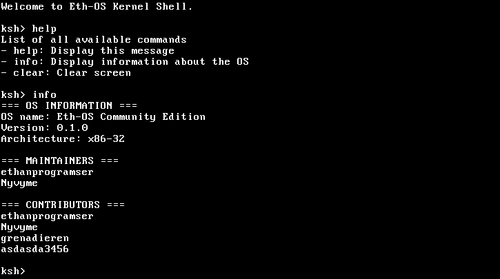

# Eth-OS Community Edition
<div align="center">



[](https://github.com/ethanprogramser/eth-os-com/actions)
[](https://github.com/ethanprogramser/eth-os-com/commits)
[](https://github.com/ethanprogramser/eth-os-com/graphs/contributors)
[](https://github.com/ethanprogramser/eth-os-com/stargazers)

</div>

## About
Eth-OS Community Edition is a community-driven 32-bit operating system based on [Eth-OS](https://github.com/ethanprogramser/eth-os). The project is being developed as part of the [Programming Everyday](https://www.youtube.com/watch?v=fyZ0Gs9W194&list=PL29dTm11fF9QNI7_xIxwjcaLFCeNhaCym&pp=iAQB) YouTube series by [eprograms](https://www.youtube.com/@eprograms).

## Features and Roadmap
### Implemented
- ✅ Boot process
- ✅ VGA driver
- ✅ GDT (Global Descriptor Table)
- ✅ Interrupts
- ✅ Timer
- ✅ Basic keyboard driver

### In Development
- 🚧 Shell
- 🚧 Filesystem
- 🚧 Standard library

### Planned
- 📋 Basic GUI library
- 📋 Window manager
- 📋 Code editor

## Building from Source

### Prerequisites
#### Required Tools
- NASM (Assembly compiler)
- GCC or Clang (C compiler)
- GRUB (Bootloader)
- xorriso (ISO image creator)
- GNU Make (Build system)
- MTools (Disk image manipulation)
- QEMU (For running the OS)

#### Optional Tools
- [compiledb](https://github.com/nickdiego/compiledb) - Generates `compile_commands.json` for clangd

### Build Instructions

#### Basic Build
```bash
# Compile OS and create ISO image
make

# Compile and run in QEMU
make run

# Clean build artifacts
make clean
```

#### Development Build (with compile_commands.json)
```bash
# Build with compilation database
./compile.sh

# Build and run
./compile_and_run.sh

# Clean build
./clean.sh
```

## Contributing
Contributions are welcome! Please feel free to submit a Pull Request. For major changes, please open an issue first to discuss what you would like to change.

## License
[MIT License](LICENSE)

## Acknowledgments
- Thanks to all [contributors](https://github.com/ethanprogramser/eth-os-com/graphs/contributors)
- Special thanks to [eprograms](https://www.youtube.com/@eprograms) for the original Eth-OS
